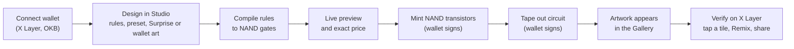
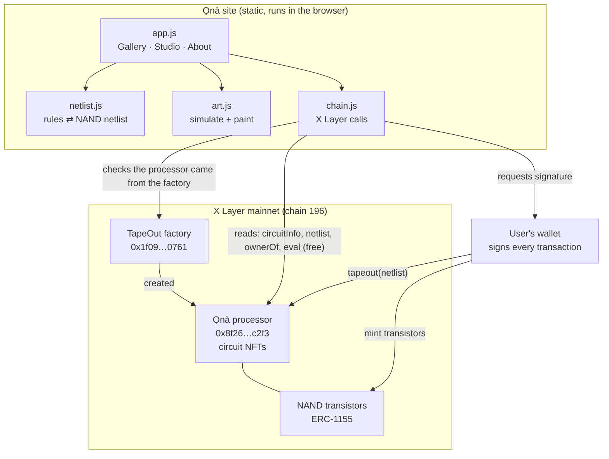
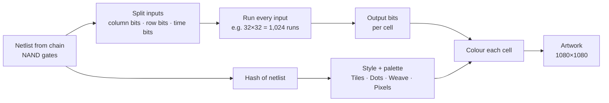

# Ọnà

Circuit art on X Layer.

**Live site:** https://mhiah.github.io/ona/

Built for the [TapeOut Genesis Transistor Hackathon](https://ignix.bot/x_campaign) on X Layer.

## What Ọnà is

Every circuit taped out on [TapeOut](https://tapeout.net) is a small program made of NAND gates, stored on X Layer. Ọnà runs that program for every possible input and paints each answer as one cell of a picture.

The picture comes only from the circuit's logic. The same circuit always draws the same artwork, and anyone can check it against the chain, so a piece can't be faked or changed.

**Use case:** create and own generative art that anyone can verify. You design a piece in the Studio, mint it on X Layer, and the chain proves the picture really comes from that circuit. Every piece uses the Ọnà processor's transistors, so the processor has a real job.

## Hackathon requirements

How Ọnà meets each rule of the [TapeOut Genesis Transistor Hackathon](https://ignix.bot/x_campaign):

| Rule | Ọnà |
|---|---|
| The processor must be deployed on X Layer through the TapeOut factory | Deployed through the TapeOut factory on X Layer mainnet at [`0x8f260db93dfb2a0ecb4172bcb35edd18b21ec2f3`](https://www.oklink.com/xlayer/address/0x8f260db93dfb2a0ecb4172bcb35edd18b21ec2f3) |
| Transistor supply, unit price and any cap must be set and publicly disclosed at deployment | 10,000 NAND transistors (this is the cap) at 0.0005 OKB each. See [Processor disclosure](#processor-disclosure) |
| At least one circuit must be taped out on the processor before the window closes | Every artwork minted in the Studio is a circuit taped out on the Ọnà processor |
| The project must have a clear use case | Generative art you design, own and verify on chain, where the picture is the circuit's own logic |
| Submit the processor address, deployment wallet, product demo and project description | Processor address above, live demo at https://mhiah.github.io/ona/, description in this README |

## Processor disclosure

These values were set when the processor was deployed through the TapeOut factory. They are permanent and cannot be changed.

| | |
|---|---|
| Name / symbol | Ọnà / ONA |
| Processor address | [`0x8f260db93dfb2a0ecb4172bcb35edd18b21ec2f3`](https://www.oklink.com/xlayer/address/0x8f260db93dfb2a0ecb4172bcb35edd18b21ec2f3) |
| Network | X Layer mainnet (chain id 196), gas paid in OKB |
| Total supply (cap) | **10,000** NAND transistors |
| Price | **0.0005 OKB** per transistor |
| Deployed through | TapeOut factory `0x1f09daefa827f02cbb40967cc91b259763760761` |

## How it works

### Workflow



1. **Connect** an OKX Wallet or MetaMask on X Layer.
2. **Design** in the Studio by writing rules over each cell's column and row, or start from a preset, Surprise or your wallet address. Turn on Moving for an 8-frame animation.
3. **Compile.** The site turns the rules into a NAND netlist, the same format TapeOut stores on chain.
4. **Preview.** The artwork is drawn live, and the site asks the processor for the exact cost.
5. **Mint.** Your wallet buys exactly as many NAND transistors as the design needs from the Ọnà processor.
6. **Tape out.** Your wallet sends the netlist to the processor, which burns those transistors and creates your circuit NFT.
7. **See and verify.** The artwork appears in the Gallery. Anyone can open it, tap a tile, check it on chain, or remix it.

### Architecture



There is no server and no contract of Ọnà's own. The site is plain files on GitHub Pages. Reads go straight to public X Layer RPCs, and every write is signed in the user's wallet and sent to TapeOut's contracts.

### From circuit to art



Each cell of the picture is one question to the circuit: "what do you answer for this column and row?" The answer bits pick the cell's colour. Because the picture is only the circuit's answers, the same circuit always gives the same artwork, and `eval` on chain proves it.

## What you can do

- **Gallery.** Shows every artwork taped out on the Ọnà processor, read live from X Layer. You can also paste any other TapeOut processor address and see its circuits as art.
- **Tap a tile.** Tap any cell of an artwork to see which input it asked the circuit and what the circuit answered.
- **Verify.** Asks the processor contract to run sample inputs (`eval`, a free read call) and checks the answers against the picture.
- **Studio.** Design an artwork by writing up to three simple rules over each cell's column (`x0, x1…`) and row (`y0, y1…`). Start from a preset, press Surprise, or make art from your wallet address. The site compiles the rules into NAND gates, previews the artwork live, and shows the exact cost.
- **Moving pieces.** Turn on Moving and the circuit also gets three time inputs, so the artwork animates through 8 frames.
- **Remix.** Open any artwork and press Remix to load its rules into the Studio and change them.
- **Mint & tape out.** Your wallet buys exactly as many transistors as the design needs, then tapes the circuit out on the Ọnà processor. You own the result as a circuit NFT.
- **Share.** Download a 1080×1080 PNG or post it to X with a link back to the piece.

## How the art is made

1. Read the circuit's netlist, input and output counts, and owner from the processor.
2. Decode the netlist. A NAND gate is `0x00` followed by two 24-bit signal ids, and a latch is `0x01` followed by one. The last outputs are the circuit's answers.
3. Split the inputs into column bits and row bits (up to a 128×128 grid), plus time bits for moving pieces, and simulate every combination in the browser.
4. Hash the netlist to choose the style (Tiles, Dots, Weave or Pixels) and the palette. The output bits choose each cell's colour.
5. Circuits with latches carry their state from cell to cell in reading order, so memory shows up as patterns.

## Cost of an artwork

Each NAND gate in a design uses one transistor. Studio designs use about 10 to 30 NAND gates.

The buyer pays:

```
NAND count × 0.0005 OKB  +  TapeOut mint fee  +  TapeOut tape-out fee  +  gas
```

The `NAND count × price` part goes to the processor owner. The fees go to TapeOut. A typical 18-NAND artwork costs 0.009 OKB plus fees. The app shows the live total in your wallet before you sign anything.

With 10,000 transistors in total, the processor can hold roughly 300 to 1,000 artworks, depending on design size.

## Safety

- TapeOut's X Layer contracts are new and have not been independently audited.
- Ọnà doesn't deploy any contract of its own. It only calls TapeOut's contracts.
- Before any wallet action, the app checks that the factory's implementation matches the known version.
- Every amount is shown before you sign. Ọnà never sees your keys.
- Minting and tape-out are separate transactions. If tape-out fails after minting, the transistors stay in your wallet.
- After tape-out, the app reads the netlist back from the chain to confirm it matches the design.

## Run locally

It's a static site with no build step and no dependencies.

```bash
python3 -m http.server 8000   # then open http://localhost:8000
node test/netlist.test.mjs    # compiler, decoder, simulator and remix tests
```

The processor address lives in `config.js`.

## Project layout

| File | What it does |
|---|---|
| `index.html`, `style.css` | The page and its styles |
| `config.js` | Processor address and site name |
| `js/app.js` | Gallery, Studio, detail view, wallet flow |
| `js/art.js` | Simulates a circuit and paints the artwork |
| `js/netlist.js` | Compiles rules to NAND, decodes netlists, rebuilds rules for Remix |
| `js/chain.js` | X Layer reads and TapeOut contract calls |
| `test/netlist.test.mjs` | Tests |

## Credits

Contract selectors, event topics and the factory address follow the shipped TapeOut client as documented by [CircuitDesk](https://github.com/diveyreadytodive-star/circuitdesk-ignix-tapeout) (MIT). The netlist format matches [TapeSafe](https://github.com/kin684660-commits/TapeSafe) (MIT).

MIT License.
